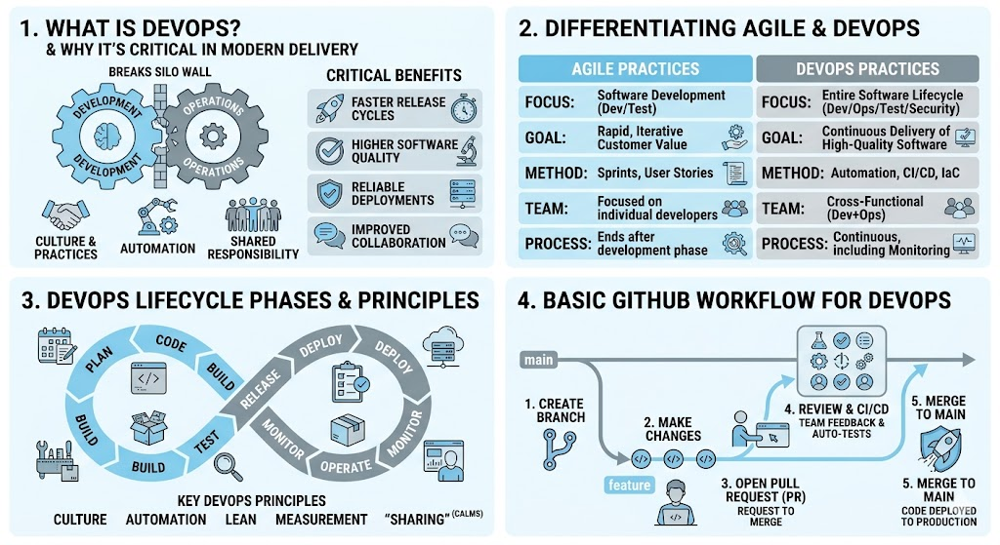

# [4.3] Introduction to DevOps and GitHub for DevOps

## Lesson Overview

## Dependencies
- [Self Studies](./studies.md)
- [Lesson](./lesson.md)
- [Assignment](./assignment.md)

## Lesson Objectives
* **Explain** what DevOps is and why it is critical in modern software delivery
* **Differentiate** between Agile and DevOps practices
* **Describe** the key principles and phases of the DevOps lifecycle
* **Apply** basic GitHub branching and pull request workflows to support DevOps practices

## Lesson Plan

| Duration | What | How or Why |
|----------|------|------------|
| 10 min | Warm up | Intro and lesson overview |
| 40 min | Part 1: DevOps foundations | Definition, Agile vs DevOps, principles, lifecycle phases, and benefits |
| 10 min | Activity 1 — DevOps in the real world | Learners research a company and discuss how DevOps solved a problem for them |
| 10 min | Activity 2 — Map the tool to the lifecycle phase | Learners match tools (e.g. Docker, Prometheus) to DevOps lifecycle phases |
| 15 min | Part 2: GitHub and branching for DevOps | Branching strategy concepts and GitHub Flow explained |
| 20 min | GitHub Flow simulation | Hands-on walkthrough — clone, branch, commit, push, open PR |
| 10 min | Advanced Git commands | git fetch, pull, stash, log, diff overview |
| 15 min | Activity 3 — Hands-on Git practice | Learners run git log, diff, fetch, stash, and stash pop on their own repo |
| 10 min | Recap and wrap up | Review key concepts, preview upcoming lessons, Q&A |
| **Total** | | **140 min — allows ~40 min buffer** |