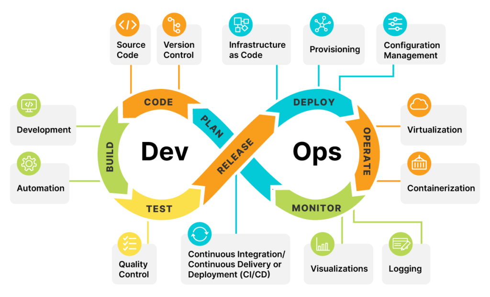

# Lesson 1: Introduction to DevOps and GitHub for DevOps

## Preparation

This lesson is primarily conceptual with guided practical demonstrations. Be prepared to continuously engage learners through discussions and short hands-on GitHub activities.

---

## Lesson Overview

This lesson introduces the core concepts of DevOps and explains how GitHub and branching strategies support DevOps practices in real-world software teams. Learners will first build a strong foundation in DevOps concepts, followed by an introduction to GitHub branching, pull requests, and essential Git commands that prepare them for CI/CD and deployment workflows in later lessons.

---

## Lesson Objectives

By the end of this lesson, learners will be able to:

1. Explain what DevOps is and why it is critical in modern software delivery  
2. Differentiate between Agile and DevOps practices  
3. Describe the key principles and phases of the DevOps lifecycle  
4. Apply basic GitHub branching and pull request workflows to support DevOps practices  

---

## Lesson Timing Breakdown (3 hours)

- Introduction and lesson overview – 10 minutes  
- Part 1: DevOps foundations – 45 minutes  
- DevOps principles and lifecycle – 45 minutes  
- Benefits and DevOps tooling overview – 25 minutes  
- Part 2: GitHub and branching for DevOps – 35 minutes  
- GitHub Flow simulation (demo) – 15 minutes  
- Advanced Git commands (overview) – 15 minutes  
- Recap and Q&A – 10 minutes  

---

## Part 1 – What is DevOps?

### Definition

> DevOps is the combination of cultural philosophies, practices, and tools that increases an organization’s ability to deliver applications and services at high velocity: evolving and improving products at a faster pace than organizations using traditional software development and infrastructure management processes.

**Plain-English explanation:** DevOps focuses on helping teams deliver software faster and more reliably by improving collaboration between development and operations teams and by automating repetitive tasks such as building, testing, and deploying applications.



---

### Is DevOps the Same as Agile?

DevOps and Agile practices are complementary approaches in the software delivery lifecycle. They both aim to improve efficiency, speed, and predictability.

Agile focuses on iterative development, collaboration, frequent feedback, and delivering value to users in small increments.

DevOps focuses on how software is built, tested, deployed, and operated after development. It removes silos between development and operations teams through automation, tooling, and shared responsibility.

---

### Principles Behind DevOps

1. Maintain version control on all production artifacts – artifacts must be stored in a centralized version control system that integrates with CI/CD pipelines.  
2. Implement CI/CD – teams deliver software continuously rather than on fixed release schedules.  
3. Automate acceptance testing – testing ensures application functionality and stability.  
4. Enforce peer review processes – changes are reviewed collaboratively to improve quality.  
5. Create a culture of high trust – teams are encouraged to experiment, collaborate, and take ownership.  
6. Instate proactive monitoring practices – systems are monitored to detect and resolve issues early.  
7. Foster win-win relationships across the organization – development and operations succeed together.

---

### DevOps Lifecycle Phases

1. **Planning** – stakeholders define features, priorities, and success criteria.  
2. **Code and Build** – code is written, committed, built, tested, and packaged.  
3. **Testing** – automated testing validates application functionality.  
4. **Continuous Integration** – frequent integration of code changes with automated checks.  
5. **Continuous Deployment** – automated deployment to production or staging environments.  
6. **Continuous Monitoring** – system health and application performance are continuously observed.

DevOps combines organizational culture, engineering practices, and tools to achieve high application delivery velocity, with CI/CD automation at its core.

---

### Benefits of DevOps

DevOps provides significant advantages for modern software teams:

- **Speed** – automation enables faster delivery of features and fixes.  
- **Rapid Delivery** – shorter and more frequent release cycles.  
- **Reliability** – automated testing and deployment reduce errors.  
- **Scale** – automation helps manage complex systems consistently.  
- **Improved Collaboration** – shared responsibility improves teamwork.  
- **Security** – security checks can be integrated directly into pipelines.

---

## Part 2 – GitHub and Branching for DevOps

### Why GitHub Matters in DevOps

GitHub plays a central role in DevOps by acting as the single source of truth for code. It enables collaboration, peer review, automation, and CI/CD integration.

Branching allows developers to work independently without affecting the main codebase, while pull requests enable review, discussion, and automated checks before code is merged.

---

### What Is a Branching Strategy?

A branching strategy defines how teams create, merge, and manage branches in a version control system. It helps teams collaborate safely, develop features in parallel, and release software confidently.

Branches protect the main codebase and allow teams to isolate changes until they are ready to be merged.


---

### GitHub Flow (Recommended for This Module)

GitHub Flow is a simple and effective branching strategy commonly used in DevOps and CI/CD environments.

Key ideas:
- The `main` branch is always deployable  
- New work is done in short-lived feature branches  
- Changes are merged back into `main` using pull requests  

Steps:
1. Create a feature branch from `main`  
2. Make and commit changes  
3. Push the branch to GitHub  
4. Open a pull request  
5. Review and merge into `main`  
6. Delete the feature branch  

This approach works well with automated CI/CD pipelines.

---

## Simulating a GitHub Flow

Step 1: Create a new feature branch  
```bash
git branch feature-yourname-test
git checkout feature-yourname-test
```

Step 2: Clone the repository  
```bash
git clone <repository-url>
```

Step 3: Make changes and commit  
```bash
git add .
git commit -m "Add feature changes"
git push origin feature-yourname-test
```

Step 4: Create a pull request on GitHub and merge it into `main`.

---

## Advanced Git Commands (DevOps Context)

### Inspecting and Comparing
- `git log` – view commit history  
- `git diff` – compare changes  

### Working with Remote Repositories
- `git fetch` – download changes without merging  
- `git pull` – fetch and merge changes  

**Key difference:** `git fetch` is safer for reviewing changes before merging.

### Working with Branches
- `git branch` – list or create branches  
- `git checkout` – switch branches  
- `git merge` – merge changes  
- `git stash` – temporarily save work  

---

## Recap

In this lesson, learners were introduced to DevOps concepts and explored how GitHub and branching strategies support DevOps practices. This foundation prepares learners for upcoming lessons on CI/CD, containerization, and deployment.
